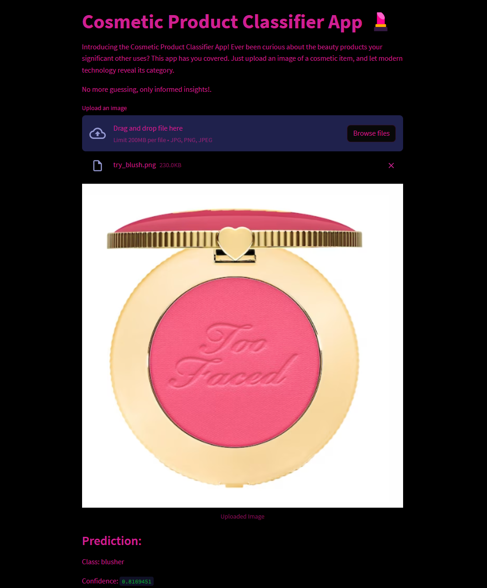
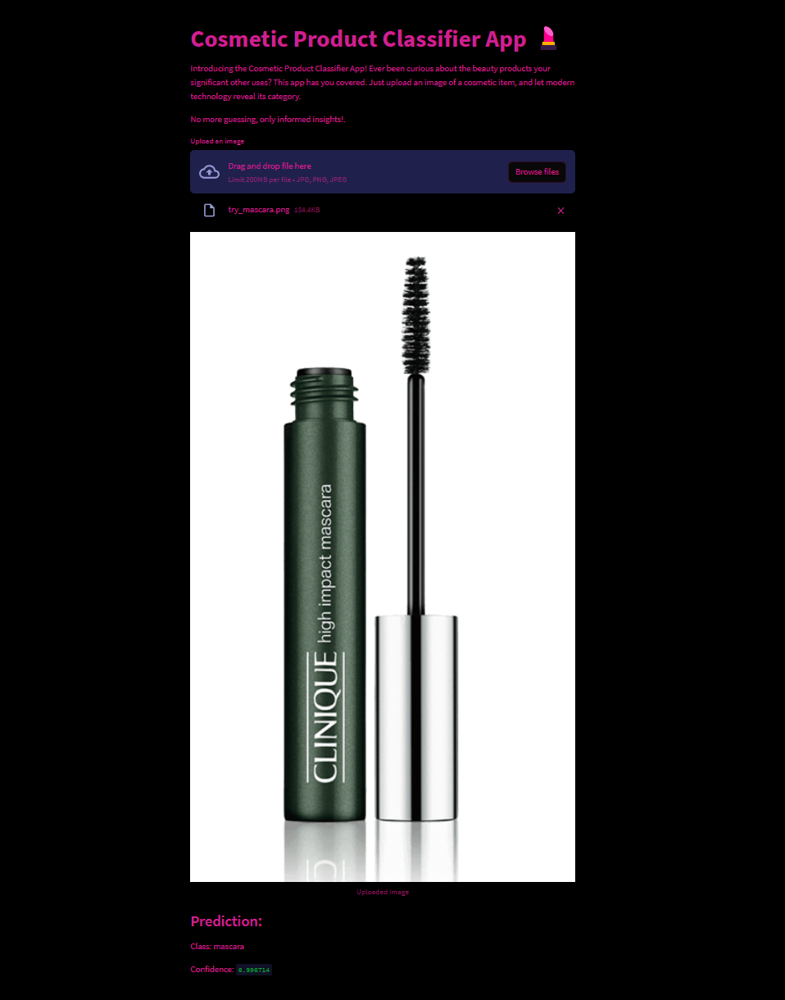

# Cosmetic Product Classifier 💅

## Overview

Welcome to the Cosmetic Product Classifier project! 🎉 This repository contains code and resources for a machine learning model and a Streamlit web application that classifies cosmetic products based on their images. The project involves web scraping cosmetic product data from the Notino website, cleaning and preprocessing the data, training a convolutional neural network (CNN) model, and creating a user-friendly app for predictions.

## Table of Contents

- [Introduction](#introduction)
- [Getting Started](#getting-started)
- [Technologies Used](#technologies-used)
- [Data Collection](#data-collection)
- [Data Preprocessing](#data-preprocessing)
- [Model Training](#model-training)
- [Streamlit App](#streamlit-app)
- [Results and Insights](#results-and-insights)
- [Usage](#usage)
- [License](#license)

## Introduction

Ever found yourself bewildered by the array of cosmetic products your significant other uses? This project aims to bring clarity to the world of cosmetics by leveraging modern technology. The Cosmetic Product Classifier identifies and categorizes cosmetic products based on uploaded images, providing users with informed insights into various cosmetic categories. 🌟

## Getting Started

To get started with the project, follow these steps:

1. Clone this repository: `git clone https://github.com/your-username/cosmetic-product-classifier.git`
2. Install the required dependencies: `pip install -r requirements.txt`
3. Run the Streamlit app: `streamlit run app_upload.py`

## Technologies Used

The development of the Cosmetic Product Classifier App relied on a comprehensive set of technologies, each serving a specific purpose in the project:

- **Selenium Web Automation Framework:** Employed to scrape cosmetic product details from various categories on the Notino website. 🕷️
- **Python Pandas:** Utilized for data processing and analysis, Pandas provided efficient data manipulation capabilities. 🐼
- **Python Imaging Library (PIL):** Employed for image processing and manipulation tasks. PIL enabled the resizing and normalization of product images. 🖼️
- **scikit-learn:** Leveraged for data preprocessing, including label encoding and stratified train-test splitting. 📊
- **TensorFlow and Keras:** Utilized for the design, training, and evaluation of the Convolutional Neural Network (CNN) model. 🧠
- **JSON and HDF5 Formats:** Employed to serialize and store the trained model's architecture and weights. 💾
- **Streamlit:** Utilized to build the interactive user interface of the app. Streamlit facilitated the creation of a user-friendly web application. 🚀

## Data Collection 

The data for this project was obtained through web scraping cosmetic product information from the Notino website using Selenium and BeautifulSoup technologies. The selected categories for data collection are as follows: Concealer, Eaux de Parfum, Eyeliner, Eyeshadow, Face Powder, Foundation, Hairspray, Lip Gloss, Lipstick, Mascara, Nail Varnish, Shampoo. All were taken from the link: [https://www.notino.co.uk/](https://www.notino.co.uk/).

The collected data includes various attributes of cosmetic products, and the columns in the dataset are as follows: Brand, Product Name, Product URL, Image URL, Description, Price, Category. Selenium was employed to automate the browsing of web pages and perform interactions, while BeautifulSoup facilitated the parsing and extraction of relevant data from the HTML content. The scraped data provides a diverse and representative sample of cosmetic products across these categories.

## [Data Processing](products_clean_analysis.ipynb#data-processing)

After scraping the data, a series of data processing steps were performed to prepare the collected dataset for model training. The processing steps were carried out using Python and the Pandas library. Here is an overview of the data processing process:

1. **Loading and Initial Examination:** The scraped data was read into a Pandas DataFrame using the `pd.read_csv()` function. An initial overview of the dataset was displayed to get a sense of its structure.

2. **Column Titles Standardization:** To ensure consistency, the column titles were converted to title case using a list comprehension. This step improved the readability and consistency of the dataset.

3. **Handling Missing Values and Duplicates:** Missing values in the "Product Name" column were dropped, and duplicate rows were removed from the dataset using the `dropna()` and `drop_duplicates()` functions.

4. **Summary Statistics:** Descriptive statistics were calculated and displayed to gain insights into the data distribution.

5. **Product Count and Brands:** The total number of products and the number of unique brands were calculated and displayed.

6. **Products per Category:** A bar plot was generated to visualize the distribution of products across different categories.

7. **Price Analysis:** The "Price" column was converted to numeric values, and an analysis of product prices was conducted.

8. **Saving Cleaned Data:** The processed and cleaned dataset was saved as [products_clean.csv](products_clean.csv)
 using the `to_csv()` function, making it ready for model training and further analysis.

## [Model Training](classifier_model.ipynb)

The trained model plays a pivotal role in the Cosmetic Product Classifier App, enabling accurate categorization of cosmetic items. The model was trained using a combination of pre-processed product images and their corresponding category labels. The following steps outline the process of training the model:

1. **Data Preparation:** The processed and normalized images were divided into train, validation, and test sets using the `train_test_split` function from `sklearn.model_selection`. The data was stratified to ensure that each set accurately represented the distribution of categories.

2. **Model Architecture:** A Convolutional Neural Network (CNN) was chosen for its ability to capture hierarchical features in images. The model architecture consisted of several convolutional and pooling layers followed by fully connected (dense) layers. Dropout layers were incorporated to prevent overfitting.

3. **Learning Rate Schedule:** A learning rate schedule was implemented using the `LearningRateScheduler` callback from TensorFlow. This schedule gradually reduced the learning rate during training to improve convergence.

4. **Early Stopping:** To prevent overfitting and optimize training time, an `EarlyStopping` callback was employed. It monitored the validation loss and halted training if the loss did not improve over a certain number of epochs.

5. **Model Compilation:** The model was compiled with the Adam optimizer and the sparse categorical cross-entropy loss function.

6. **Training and Validation:** The model was trained using the prepared data for a specified number of epochs. Both training and validation accuracy were monitored throughout training to assess model performance.

7. **Evaluation and Testing:** After training, the model was evaluated using the test set to ensure its ability to generalize to unseen data.

8. **Visualization:** The training process was visualized by plotting the accuracy curves for both training and validation sets. A confusion matrix was generated to analyze the model's performance across different categories.

9. **Classification Report:** A comprehensive classification report was printed, providing insights into precision, recall, F1-score, and support for each category.

10. **Model Export:** The trained model's architecture was serialized and saved to a JSON file (`classifier_model_architecture.json`). The model's weights were saved to an `.h5` file (`classifier_model_weights.h5`) for later use. --- files are too large to be added in the repo

11. **Model Saving:** The entire model, including architecture and weights, was saved to a single `.h5` file (`classifier_model.h5`), which could be easily loaded for future predictions.

## Streamlit App

The Streamlit app allows users to upload an image of a cosmetic product and receive predictions about its category. The app is user-friendly and intuitive, providing users with instant insights into the products they're curious about. 🌐

## Results and Insights

The trained model achieved a test accuracy of approximately 73.47%. Detailed evaluation measures, including accuracy per epoch, confusion matrix, and classification report, provide insights into the model's performance. 📊

## Usage

1. Clone the repository and navigate to its directory.
2. Install the required dependencies: `pip install -r requirements.txt`
3. Run the Streamlit app: `streamlit run app_upload.py`

## License

This project is licensed under the [MIT License](LICENSE). 📄

---
